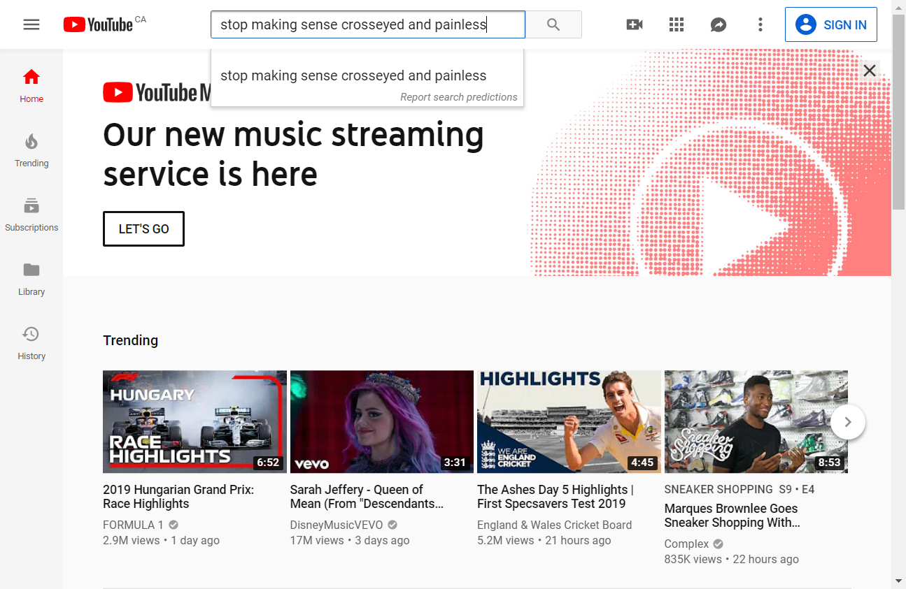
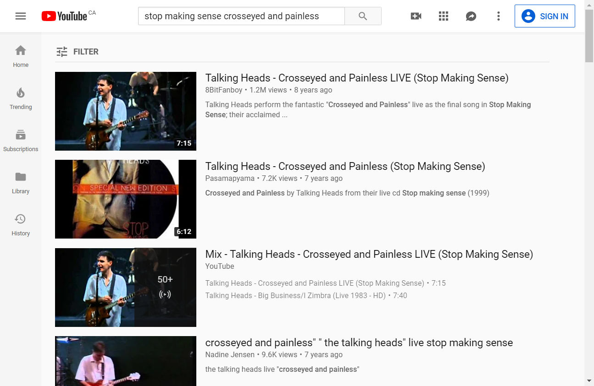
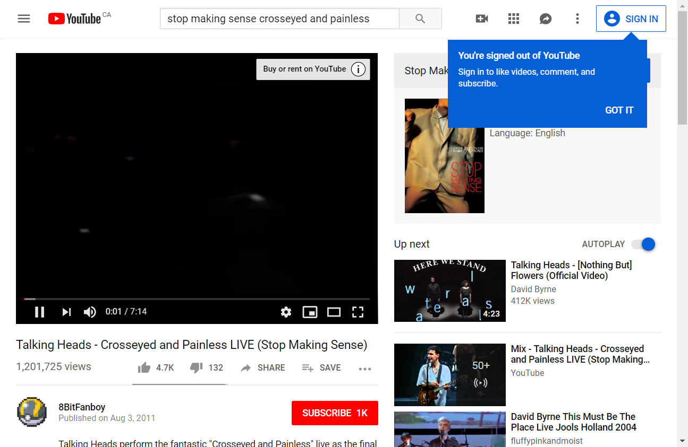

# Assignment 01

## Challenge: browZbot

### Preamble

Back when I was growing up, there were no Internet. All we had was books. And rotary phones. (And we raised chickens and my mother had me haul gravel illicitly from a nearby gravel pit for her garden...but that's not relevant to this conversation). Frankly, I don't know how I survived.

But I digress.

The primary tool used to navigate the Internet is, of course, the web browser. Web browsers are pretty amazing things...but there's so much _clicking_ you need to do when using them. Wouldn't it be better if you could automate them just by _telling_ them commands?

We're kinda going to do that. But without voice recognition, 'cause that'd be pretty hard at this point. We'll do the next best thing: _type_ commands.

---

### What you're going to build

You'll be making a program that uses one of these automation tools (it's called **Selenium**, for the curious) under the hood to allow the user to "drive" a web browser using simple commands entered from the keyboard. Here's a brief example of some of the commands in action.

**Example**

> `open youtube.com`
>
> (browser opens and displays something like this)
> 
>
> `fill search stop making sense crosseyed and painless`
>
> (text is entered in search box)
> 
>
> `click id search-icon-legacy`
>
> (the search icon is clicked and the results of search appear)
> 
>
> `click link Talking Heads - Crosseyed and Painless LIVE (Stop Making Sense)`
>
> (finale of acclaimed concert film starts playing...I'd wait around until the 1:13 mark to watch things **really** start cooking)
> 

#### Assumptions you can make

- we'll fill this in as questions arise

#### Classes involved in this assignment

This assignment involves a number of different classes; some of them you need to make code for, while others don't need to be touched.

Details of these classes can be found [here](list.of.classes.used.md).

#### Instructions

1. create and complete all required classes until they pass their tests
