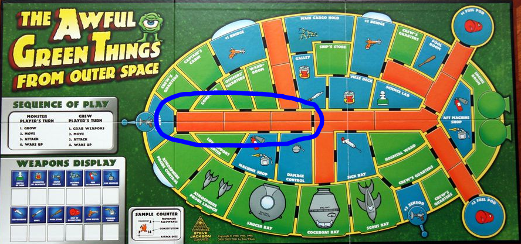

# Assignment 02

## Challenge: The Awful Green Things from Outer Space

### Preamble

This assignment is getting you to create code for a variety of objects that will be used in a prototype for a computer version of the board game The Awful Green Things from Outer Space. The prototype will not have many of the features that a full version would, as such a beast would just take too long to create and would likely drive you insane(r).

> ### An Aside
> This assignment is kind of "messy" in a number of different ways: I'm still working on the graphical part your code will be plugging into. I'm not overly happy with the way I'm designing some things and you may need to make changes in your code if I make changes in mine. You're going to be given a lot of freedom to make your classes - which can leave you confused over what to do...and then I'm going to make you change your code, which can be frustrating. 
>
> But all of this will give you some super-important experience with things that are going to happen to you as a junior developer, so that's a good thing. 
>
> And besides - I think you'll find coding up part of a game and making your own design decisions fun!

### First Steps

A great thing you can do when creating a computer version of a real-life "thing" is to become very familiar with that thing. (It's difficult to create code for a problem you don't understand - some would say it's actually impossible. I tend to agree.)

To that end, you should first become familiar with the rules of the game. They are available online here: http://www.sjgames.com/awfulgreen/img/rules.pdf. There are 12 pages, 1 of them being the cover/index and 2 being a comic strip giving you the backstory to the game (you should totally read it - Tom Wham is awesome).

_"Do I have to read all the rules?!?"_ I hear you cry mournfully. You should - the more you can immerse yourself in them, the better. That being said, if you want to know the parts you absolutely should know, I'd say:

- The comic. Stop being lazy and just read the damn thing already.
- Playing Pieces and Game Map
- Monster Players Turn
- Attacks
- Weapons
- **The Weapons (the section with the individual weapon descriptions) ←  SUPER IMPORTANT**
- **Weapon Effect Chits ← SUPER IMPORTANT**

### Simplifications

As mentioned earlier, trying to do an honest-to-God 2-player  (or 1 player vs. AI) version of this game would be unreasonable in the time left in the course. (That being said, you will totally have all the pieces you need to do much of such a thing by the end of this course!)

So here are some simplifications we'll be implementing for the sake of keeping our marbles:

- the prototype will only represent one portion of the ship - the passageway circled in blue here:
 
- there will be no Crew in the traditional sense - instead, the person playing the prototype will be "located" in the left-most area of the passageway and will not move from there
the player will have access to all weapons - since the player can't move, they can't go to a place where a weapon would normally be located and it wouldn't be very sporting to have the player be eaten as they attempt to fight the green horde with their bare hands
- the normal crew turn will be replaced with a single action: attacking AGTs with a weapon
- the normal monster's turn is as written in the rules with the following modifications
  - the game will choose to Grow the type of monsters that are most plentiful; if there is a tie, it will choose the "youngest" life stage (Eggs → Fragments → Babies → Adults)
  - the game will move all unstunned creatures as close to the player's location as possible
  - the attack is currently a work in progress...might not get this done in time!
- the player has no hand-to-hand attack option: they must always use a weapon
- the monster growth after attacks rule is ignored
- the rules in the `Running out of Monsters` section are ignored
- Leadfoot is not available (awww.....)
- the rules int the `Using Several Weapons at Once` and `Using Several Untried Weapons at Once` sections are ignored
- all rules from page 9 onward are ignored
- the player wins the game if they can eliminate all AGTs (work in progress)

## Do You Grok the Rules to The Awful Green Things from Outer Space?

Test your knowledge of the rules by answering these questions. You may need to do some additional research outside of the rule book to answer them!

> Some terminology used:
>
> - **AGT**: Awful Green Thing
> - **life stage**: Adult, Baby, Fragment, or Egg
> - **area**: see the rules section Playing Pieces and Game Map
> - **The Passageway**: the part of the ship the prototype is displaying
> - **Player Area**: the area of The Passageway the player is "standing" in (the left-most area)
> - **Adjacent Area**: the area of The Passageway next to the player area
> - **Far Area**: the area of The Passageway at the far (right-most) end

- [ ] What is the constitution of the different life stages of an AGT?
- [ ] How far can each of the different life stages of an AGT move?
- [ ] How many attack dice does each of the different life stages an AGT have?
- [ ] If you hit an Adult for 15 points of damage in one turn, how many points of damage would you need on the next turn to kill it?
- [ ] What weapon effect is the only effect that stuns an AGT?
- [ ] What is the difference between the Grow that occurs on the Monsters' turn and the Grow that occurs as a weapon effect?
- [ ] What are the different weapon effects?
- [ ] What happens when you shrink an Egg? A Fragment?
- [ ] How many creatures in the Player Area would be affected by the use of a Fire Extinguisher? A Bottle of Acid? A Gas Grenade?
- [ ] The player wants to attack AGTs in the Far Area. Which weapons will allow that?
- [ ] The player wants to attack AGTs in the Adjacent Area. Which weapons will allow that?
- [ ] Which weapons will allow the player to attack a single AGT in the Player Area? Adjacent? Far? 
- [ ] Which weapons affect all AGTs in all areas at the same time?
- [ ] Which weapon effect might actually increase how many things are present in an area?
- [ ] There are 3 adults, 2 babies, 1 fragment, and 5 eggs in the Player Area. 1 of the Adults and 1 of the Eggs are stunned. How many dice of damage are rolled against the player?

