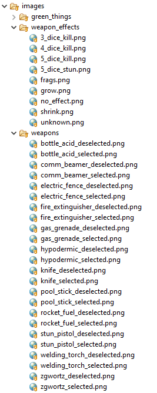

# Phase One

## PREAMBLE

Up to now, I've been very prescriptive when it's come to assignments and drills and lab quizzes: it's all "build *these* methods that have *these* signatures that pass *these* tests".

While this way of teaching coding has its benefits, what it _doesn't_ do very well is give you experience is figuring out for yourself what methods to make, what to call them, what they take in as input, and what they return as output.

So in phase one, we'll change that.

## BACKGROUND

Let's say you're working on a very small team - maybe two or three people in total - developing the AGTFOS game. You've decided over beer (or whatever it is you youth drink these days in a social setting) on a general plan of attack and you've agreed to split up some of the necessary - at least you **think** they might be necessary - tasks amongst yourselves.

## DELIVERABLES

You need to create four classes, along with tests for them. (The amount of test code you're expected to create is **very** small - I just want you to get a taste of the process, not turn you into some time of Testing Deity. Yet.)

We'll talk about how to write your test code in lab on November 19.

Use the starting project (<https://classroom.github.com/a/QiQBx3AT>) as a place to put your code.

1. A utility class that will be used to handle the rolling of the dice.
   - You can easily find information in the text or online in how to generate random numbers within a given range in Java. You should include "java Random class" in any Googling you do.
   - This is a usefult site for when it comes time to test your class: <https://www.omnicalculator.com/statistics/dice>
1. A utility class that will be used to return the paths to the icons used in the game.
   - The person working on the art side of things promises that all icons will be in a structure that looks like this: .
   - They also promise that all icon files will be in png format.
   - They also promise (they're big on promises) that icons will **always** be in a root folder called **images** and that their code will only ever need to get icons for AGTs, weapon effects, and weapons.
1. A "regular" class to capture the behaviour of an AGT's life stage. (Adult, Baby, Fragment, Egg).
   - This class should be able to handle the fact that AGTs can grow and shrink in the game.
1. A "regular" class to capture the behaviour of an AGT.
   - This class should be able to create AGTs of different life stages with the associated constitution, movement, and attack dice.
   - There is that pesky "5 Dice to Stun" weapon effect to consider....

## DON'T GROW ATTACHED TO YOUR CODE

You're totally going to have to change it down the road. Fortunately, Eclipse makes many changes quite easy, so the changes won't be _too_ painful. But if I said they weren't going to sting a bit, I'd be lying.
